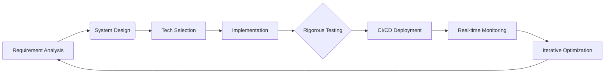

  

  

<!--      -->
  
  <a href="mailto:ajayhunt04@gmail.com" target="_blank">
    
<!--      -->
  

  

---

  

<!--     <h2 style="color: #6F42C1; margin-top: 0;">Ajay Kumar</h2> -->
    

      🎯 <strong>Senior Frontend Engineer | React, TypeScript, Redux, Angular | 5+ Years Experience</strong>  
      I'm a results-driven frontend developer with 5+ years of experience building high-performance, scalable web applications using modern JavaScript frameworks. My expertise lies in creating pixel-perfect UI, architecting reusable components, integrating APIs, and delivering responsive, user-centric experiences.
    

  

---

## 🛠 Tech Stack

  <h3>Languages & Core</h3>
  

    
    
    
    
    
  

  <h3>Frameworks & Libraries</h3>
  

    
    
    
    
  

  <h3>UI & Real-Time</h3>
  

    
    
    
    
  

  <h3>Tools & Infrastructure</h3>
  

    
    
    
    
  

---

## 💼 Professional Experience Highlights

- 🚀 Migrated enterprise-scale React app to Angular 17 with TypeScript and Kendo UI, improving modularity and reducing tech debt
- 📊 Built real-time dashboard apps for gaming and education platforms using WebRTC, Socket.io, and dynamic charts  
- 🧩 Developed role-based access systems, reusable UI components, and multilingual support across multiple apps  
- 🤝 Collaborated in Agile teams to ship production-ready features with strong CI/CD and API integration practices

---

## 🧠 Technical Workflow

---

  

